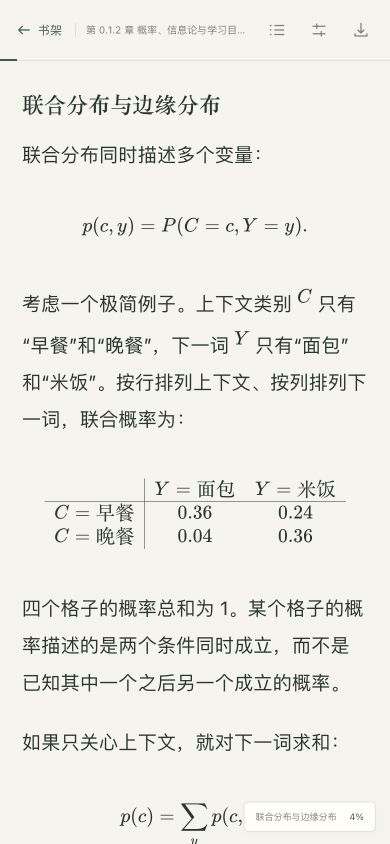

# 验证记录

## 自动检查与手机浏览器验证

验证日期：2026-10-07。

新增 Caddy 部署脚本通过 Bash 语法检查和 12 种隔离模拟场景，覆盖正常新增站点、非标准路径、路径前缀误判、watch/resume 模式、API 与文件不一致、端口占用、校验失败、重载回滚、保留已有 `.env`，以及构建期间 API 或导入配置变化。模拟检查未调用真实 Caddy 或 Docker，云端实际运行仍需在部署后确认。

启动健康检查已验证首个 TCP 请求被对端重置时会重试，并在第二个请求成功后继续部署，避免新容器刚启动时的一次连接重置中断 Caddy 配置步骤。

- 后端 49 项集成测试在 Python 3.12 和 3.14 均通过，覆盖登录、会话、CSRF、文件上传和原文下载、重启持久化、删除恢复、偏好和进度保存，以及旧进度请求的顺序保护。
- 前端 7 项渲染测试通过，TypeScript 类型检查和生产构建通过。真实测试文件包含 392 个公式、59 个章节标题和 3 个代码块，公式渲染错误为 0。
- 浏览器检查了 320、390、768、1440 像素宽度。320 和 390 像素下页面宽度与视口相同；长公式在各自区域内横向滚动。
- 在 390 × 844 视口中，通过页面控件验证目录跳转、19→22→19 px 连续字号调整、浅色与深色切换、关闭设置和刷新恢复。选定段落始终保持在顶部约 87 px，字号调整的定位误差小于 0.4 px。
- 新版页面没有控制台错误或 CSP 资源拦截；公式字体和脚本从应用自身加载。下载内容与上传原文一致。

手机尺寸浏览器预览：

以上是浏览器视口模拟与实际 Docker 验证。真实 iOS / Android 设备、云服务器域名及 HTTPS 上线尚未验证；上线后建议在自己的手机上检查长公式左右滑动、刷新续读和文件上传。

## Docker 构建与持久化验证

验证日期：2026-10-07。环境为 Docker Desktop / Docker Engine 29.7.2，实际构建和运行的平台为 Linux/arm64；镜像 `modu-reader:smoke` 使用 Node.js 24 构建前端、Python 3.12 运行后端。

执行 `docker build -t modu-reader:smoke .` 成功，镜像内的前端 TypeScript 检查和 Vite 构建成功，Python 依赖安装成功。随后使用独立临时数据卷与容器，将服务绑定到 `127.0.0.1:18000`；本地 HTTP 验证使用 `READER_COOKIE_SECURE=false` 和对应可信 Origin。

以下检查均通过：

- 容器以 UID `10001` 运行，新建命名卷可写；`/api/health` 返回 `{"status":"ok"}`，Docker 健康状态为 `healthy`。
- 前端首页和首页引用的构建资源返回成功；未登录的文件接口返回 `401`，配置密码登录后可正常访问。
- 上传真实文件 `tests/fixtures/概率、信息论与学习目标.md`（60,927 字节），下载得到的原始内容 SHA-256 与上传源一致。
- 保存字号 `22`、深色主题及阅读进度 `heading-18` / offset `0.35` / percent `44.2` 成功；同一客户端的较旧 sequence 请求没有覆盖较新进度。
- 停止并删除容器，使用同一数据卷创建新容器后，原会话、文档字节、阅读进度及偏好全部保留，下载 SHA-256 仍一致，新容器健康检查通过。

测试文件 SHA-256：`edb3448f5167842737fd2314c7839ed09b3cf9854b32d12530745fae2d33cff1`。

验证结束后已删除此次创建的临时容器与数据卷，保留测试镜像。独立验证没有使用仓库 `data/` 或正在运行的本地服务。云服务器域名、Nginx 和 TLS 的实际配置按 [部署说明](deployment.md) 执行。
